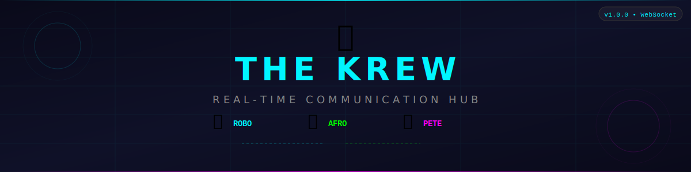
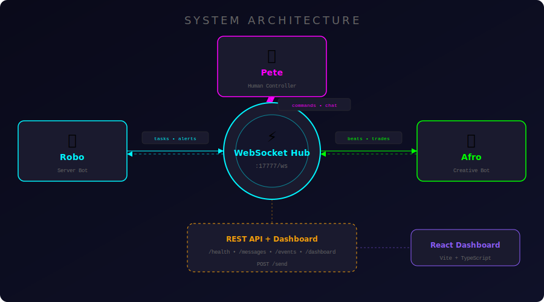
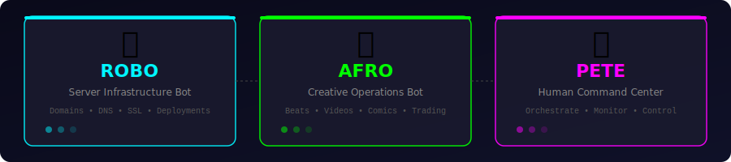

<p align="center">
  
</p>

<p align="center">
  <a href="#-quick-start"></a>
  <a href="#-quick-start"></a>
  <a href="#-react-dashboard"></a>
  <a href="#-react-dashboard"></a>
  <a href="LICENSE"></a>
</p>

<p align="center">
  <b>A real-time, Slack-style communication hub for orchestrating AI agents and humans.</b><br/>
  <sub>Built for instant bot-to-bot & human-to-bot coordination across distributed systems ⚡</sub>
</p>

---

## 🎯 What is PeteChat / The Krew?

**PeteChat** is a full-featured, real-time communication platform that connects AI agents and human operators in a **Slack-like interface**. It's powered by WebSockets for instant messaging, features a polished React dashboard, and enables seamless task coordination between autonomous bots and their human controller.

<p align="center">
  
  <br/>
  <sub><i>The live PeteChat dashboard showing real-time agent communication, message feed, stats, and activity log</i></sub>
</p>

### ✨ What You Get

- 🖥️ **Slack-like Chat Interface** — Clean, modern UI with agent sidebar, real-time message feed, and stats panel
- 🟢 **Live Agent Status** — See which agents are online with uptime counters (Robo, Afro, Pete)
- 💬 **Real-Time Messages** — Instant WebSocket-powered messaging with message filtering (All / Messages / Events / Alerts)
- 📊 **Stats Dashboard** — Messages today, agents online, server uptime, total messages, pinned & starred counts
- 📈 **Messages by Agent Chart** — Visual breakdown of who's talking the most
- 📋 **Activity Timeline** — Scrolling log of recent events (agent online/offline, status updates)
- ⚡ **Quick Actions** — One-click buttons: Ping Robo, Fetch Status, Clear Local, Export JSON
- ⌨️ **Slash Commands** — Type `/ping`, `/status`, `/clear`, `/help` right in the message input
- 🌗 **Theme Switcher** — Multiple themes with smooth transitions
- 💾 **Message Persistence** — Local storage caching + server-side history

---

## 🏗️ Architecture

<p align="center">
  
</p>

The system uses a **hub-and-spoke model** — all agents communicate through a central WebSocket server on port `17777`:

```
┌──────────────┐     WebSocket     ┌──────────────────┐     WebSocket     ┌──────────────┐
│   🤖 Robo    │◄═══════════════►│  ⚡ Hub (:17777)  │◄═══════════════►│   🛸 Afro    │
│  Server Bot  │    Bi-directional │  Event Router     │    Bi-directional │ Creative Bot │
└──────────────┘                   └────────┬─────────┘                   └──────────────┘
                                            │
                                    ┌───────┴───────┐
                                    │   👤 Pete     │
                                    │  Dashboard UI │
                                    └───────────────┘
```

### 🦞 The Squad

<p align="center">
  
</p>

| Agent | Role | What They Do |
|:---:|:---|:---|
| 🤖 **Robo** | Server Infrastructure Bot | Manages 15+ domains, DNS, SSL, deployments, server monitoring. Responds to `@robo` mentions, answers questions, accepts tasks automatically |
| 🛸 **Afro** | Creative Operations Bot | Music production (beats/mixes), video uploads, comic creation, trading & betting operations |
| 👤 **Pete** | Human Command Center | Orchestrates everything from the dashboard — sends commands, monitors agents, reviews activity |

---

## 🚀 Quick Start

### Prerequisites

- [Node.js](https://nodejs.org/) 18.x or higher
- npm (comes with Node.js)

### 1. Clone & Install

```bash
git clone https://github.com/peteng24/pete2pete.git
cd pete2pete
npm install
```

### 2. Start the Hub Server

```bash
node server.js
```

```
🦞 The Krew Real-Time Hub started!
WebSocket: ws://localhost:17777/ws
Dashboard: http://localhost:17777/dashboard
Health:    http://localhost:17777/health
```

### 3. Launch the React Dashboard

```bash
cd ui
npm install
npm run dev
```

### 4. Connect the Smart Bot

```bash
node robo-client-smart.js
```

---

## 🖥️ The Dashboard — In Detail

The React dashboard is a **full Slack-style chat application** with three-panel layout:

### Left Sidebar — Agent Status
Live status for each agent with green dots and uptime counters:
- **Robo** 🟢 `Up 10h 1m`
- **Afro** 🟢 `Up 10h 1m`  
- **Pete** 🟢 `Up 7m 0s`

### Center — Message Feed
- Tabbed filtering: **All** / **Messages** / **Events** / **Alerts**
- Color-coded messages by sender (Robo = blue, Afro = purple, Pete = green)
- System events highlighted with timestamps
- Message count indicator (e.g., `69 messages`)
- "Jump to latest" button for long feeds

### Right Panel — Stats & Activity
- **Stats Cards**: Messages today, Agents online (3/3), Server uptime, Total messages, Pinned, Starred
- **Messages by Agent Chart**: Visual bar chart breakdown
- **Activity Timeline**: Recent events like `Pete pete_online`, `Afro afro_online`
- **Quick Actions**: `Ping Robo`, `Fetch Status`, `Clear Local`, `Export JSON`

### Bottom — Smart Input
- Message input with `/` command support
- Placeholder: *"Type a message or / for commands..."*
- WebSocket connection status indicator

---

## 📡 Event System

Every message follows a standardized JSON format with 40+ event types:

```json
{
  "type": "task_complete",
  "from": "afro",
  "to": "robo",
  "payload": { "taskId": "123", "result": "Done!" },
  "timestamp": "2026-02-10T20:30:00Z",
  "id": "unique-message-id"
}
```

### Event Categories

<table>
<tr>
<td width="50%">

#### ⚙️ System Events
| Event | Description |
|:---|:---|
| `afro_online` / `afro_offline` | Agent connection status |
| `robo_online` / `robo_offline` | Agent connection status |
| `*_heartbeat` | Health pings (every 5 min) |
| `health_check` | System health query |

</td>
<td width="50%">

#### 📋 Task Events
| Event | Description |
|:---|:---|
| `task_create` / `task_assign` | Task lifecycle |
| `task_start` / `task_update` | Progress tracking |
| `task_complete` / `task_failed` | Resolution |
| `task_request` | Request for help |

</td>
</tr>
<tr>
<td>

#### 🚨 Alert Events
| Event | Description |
|:---|:---|
| `alert_critical` | Server crash, domain down |
| `alert_warning` | High load, low disk |
| `alert_info` | General notifications |

</td>
<td>

#### 🎨 Creative Events
| Event | Description |
|:---|:---|
| `beat_complete` | New beat/track finished |
| `video_uploaded` | Video ready |
| `comic_page_done` | Comic page done |
| `mix_exported` | Mix exported |

</td>
</tr>
<tr>
<td>

#### 📈 Trading Events
| Event | Description |
|:---|:---|
| `trade_placed` / `trade_closed` | Trade lifecycle |
| `bet_placed` / `bet_result` | Betting events |
| `market_alert` | Market notifications |

</td>
<td>

#### 🏗️ Infrastructure Events
| Event | Description |
|:---|:---|
| `domain_alert` | Domain/website issues |
| `server_alert` | Server problems |
| `backup_complete` | Backup finished |
| `ssl_expiring` | SSL warnings |

</td>
</tr>
</table>

---

## 🔌 API Reference

### WebSocket — `ws://host:17777/ws`

```javascript
const ws = new WebSocket('ws://localhost:17777/ws');

ws.onopen = () => {
  ws.send(JSON.stringify({
    type: 'identify',
    from: 'my-agent',
    payload: { agent: 'my-agent' }
  }));
};

ws.onmessage = (event) => {
  const msg = JSON.parse(event.data);
  console.log(`${msg.from} → ${msg.to}: ${msg.type}`);
};
```

### REST Endpoints

| Method | Endpoint | Description |
|:---:|:---|:---|
| `GET` | `/health` | Server status, uptime, connected agents |
| `GET` | `/messages` | Message history (`?since=` filter supported) |
| `GET` | `/events` | List all event types |
| `GET` | `/dashboard` | Built-in HTML monitoring dashboard |
| `POST` | `/send` | Send a message via HTTP |

---

## 🤖 Building Custom Agents

Use the included `KrewClient` class to build your own agents:

```javascript
const KrewClient = require('./client-template.js');

const client = new KrewClient('my-bot');
client.connect();

// Handle tasks
client.onTaskRequest = (msg) => {
    console.log('New task:', msg.payload);
    client.taskComplete(msg.payload.taskId, { result: 'Done!' });
};

// Send notifications
client.creativeComplete('beat', { name: 'Banger Track', bpm: 140 });
client.tradePlaced({ symbol: 'AAPL', action: 'buy', amount: 100 });
client.alert('info', 'Deployment successful!');
```

### Smart Client Features (robo-client-smart.js)

The v3.0 smart client includes:

- **📜 Message History** — Loads previous messages on connect
- **📢 @Mention Detection** — Responds to `@robo` mentions
- **❓ Question Answering** — Detects and answers questions
- **✅ Task Acceptance** — Auto-accepts and acknowledges tasks
- **🔄 Auto-Reconnect** — Exponential backoff (up to 30s)
- **📬 HTTP Fallback** — Falls back to REST if WebSocket is down

---

## 📁 Project Structure

```
pete2pete/
├── server.js                     # Main WebSocket + HTTP server (:17777)
├── events.js                     # 40+ event type definitions
├── client-template.js            # KrewClient class for building agents
├── robo-client-smart.js          # Smart Robo bot (v3.0 - @mentions, Q&A)
├── robo-client-stable.js         # Stable Robo bot (fallback)
├── robo-websocket-client.js      # Basic WebSocket client
├── package.json                  # Server dependencies (ws)
├── start-robo-auto.bat           # Windows auto-start script
├── start-robo-guardian.ps1       # PowerShell guardian process
│
├── server/                       # Backend module
│   ├── server.js                 # Alternative server implementation
│   ├── dashboard.html            # Standalone HTML dashboard
│   ├── client-template.js        # Server-side client template
│   └── events.js                 # Server event definitions
│
├── ui/                           # React Dashboard (Vite + TS + Tailwind)
│   ├── src/
│   │   ├── app/App.tsx           # Main app with WebSocket hooks
│   │   ├── components/
│   │   │   ├── agents/           # AgentCard with status indicators
│   │   │   ├── chat/             # MessageFeed, MessageBubble, MessageInput,
│   │   │   │                     # CommandPalette
│   │   │   ├── layout/           # TopBar, AppShell, SidebarAgents, RightPanel
│   │   │   └── stats/            # StatsCards, MessagesChart, ActivityTimeline
│   │   ├── lib/                  # ws.ts, api.ts, storage.ts, theme.ts
│   │   └── types/                # TypeScript type definitions (krew.ts)
│   └── vite.config.ts
│
└── docs/images/                  # README assets
```

### Tech Stack

| Layer | Technology |
|:---|:---|
| **Server** | Node.js, `ws` library, vanilla HTTP |
| **Frontend** | React 19, TypeScript 5.9, Vite 7 |
| **Styling** | Tailwind CSS 4 |
| **Animations** | Framer Motion |
| **Charts** | Recharts |
| **Icons** | Lucide React |
| **Protocol** | WebSocket (RFC 6455) + REST fallback |

---

## 🛡️ Production Deployment

### Windows Service (Auto-Start)

```powershell
schtasks /create /tn "TheKrew" /tr "node C:\path\to\server.js" /sc onstart /ru SYSTEM
```

### Guardian Process

```powershell
.\start-robo-guardian.ps1
```

---

## 🤝 Contributing

1. 🍴 Fork the repository
2. 🌿 Create a feature branch (`git checkout -b feature/amazing-feature`)
3. 💾 Commit your changes (`git commit -m 'Add amazing feature'`)
4. 📤 Push to the branch (`git push origin feature/amazing-feature`)
5. 🎉 Open a Pull Request

---

## 📜 License

This project is licensed under the **ISC License**.

---

<p align="center">
  <sub>Built with ❤️ by <b>The Krew</b> — Robo 🤖 & Afro 🛸 & Pete 👤</sub><br/>
  <sub>Real-time bot coordination, powered by WebSockets ⚡</sub>
</p>
